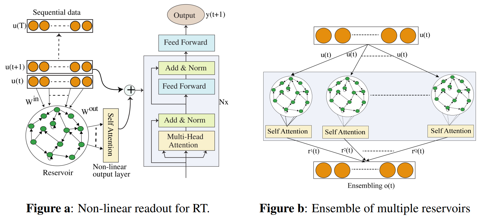

#  CHANGES BY BUTTERFLIES: FARSIGHTED FORECASTING WITH GROUP RESERVOIR TRANSFORMER
## Abstract
In Chaos, a minor divergence between two initial conditions exhibits exponential amplification over time, leading to far-away outcomes, known as the butterfly effect. Thus, the distant future is full of uncertainty and hard to forecast.   We introduce Group Reservoir Transformer to predict long-term events more accurately and robustly by overcoming two challenges in Chaos:  (1) the extensive historical sequences and (2) the sensitivity to initial conditions. A reservoir is attached to a Transformer to efficiently handle arbitrarily long historical lengths, with an extension of a group of reservoirs to reduce the uncertainty due to the initialization variations.  Our architecture consistently outperforms state-of-the-art DNN models in multivariate time series, including NLinear, Pyformer, Informer, Autoformer, and the baseline Transformer, with an error reduction of up to -89.43\% in various fields such as ETTh, ETTm, and air quality, demonstrating that an ensemble of butterfly learning, the prediction can be improved to a more adequate and certain one, despite of the traveling time to the unknown future



</br>

### Setup
We conduct our experiment with Anaconda3. If you have installed Anaconda3, then create the environment for P-tuning v2:

```shell
conda create -n RT python=3.10.12
conda activate RT
```

After we setup basic conda environment, install pytorch related packages via:

```shell
conda install pytorch torchvision torchaudio pytorch-cuda=11.8 -c pytorch -c nvidia
```

Finally, install other python packages we need:

```shell
pip install -r requirements.txt
```

After, clone the GitHub repo and follow the examples dir
